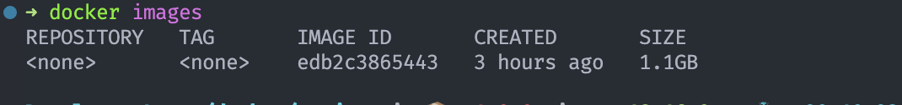
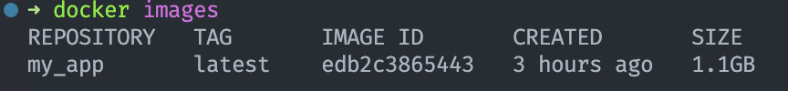
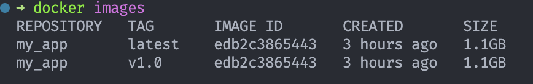

# 🐳 Introdução

> Arquivos de programas básicos, possibilita que o docker crie e execute alguns comandos

## Imagens Docker

- https://hub.docker.com -> repositório oficial de imagens
- Se atentar as imagens que possuem o selo de oficial

## Criando uma imagem

- Para criar uma imagem precisamos do arquivo `Dockerfile` na raiz do nosso projeto
- O arquivo precisa de algumas instruções
- `FROM` -> imagem base
- `WORKDIR` -> diretório da aplicação
- `EXPOSE` -> porta de aplicação
- `COPY` -> quais arquivos precisam ser copiados

### Exemplo de arquivo de imagem `Dockerfile`

```dockerfile
FROM node
WORKDIR /app
COPY package*.json .
RUN npm install
COPY . .
EXPOSE 3333
CMD [ "node", "./src/index.js" ]
```

### Executando a Imagem criada

- Para executar a imagem que criamos usamos o comando `build`
- `docker build <diretorio da imagem>`
- Depois utilizamos o comando `docker run <imagem>`para executá-la
- Para tornar visível a imagem no momento que estivermos rodando podemos usar o comando:

```bash
docker run -d -p 3333:3333 --name app_node <id imagem>
```

### Listando e removendo imagens

- Listando imagens

```bash
# lista todas  as imagens com a descrição completa
docker image ls
# listando de modo simplificado
docker images
```

- Deletando uma imagem

```bash
docker image rm <id/nome imagem>
```

- Obtendo ajuda

```bash
docker image --help
# mostra o suporte de ajuda dos comandos relacionados a image
```

### Alterando uma imagem

- Sempre que alteramos nosso código é necessário fazer o build novamente
- Para o docker é como se fosse uma imagem completamente nova
- Após o build vamos executar em outro id único usando o `docker run`

### Cache de camadas

- As imagens do Docker são divididas em camadas (`layers`)
- Cada instrução do `Dockerfile` representa um _layers_
- Quando algo é atualizado apenas as layers depois da linha atualizada são refeitas
- O restante permanece em **cache**, tornando o build mais rápido

### Download de imagens

- Podemos fazer o download de uma imagem do hub e deixá-la disponível em nosso ambiente
- Utilizamos o comando `docker pull <imagem>`
- Tornamos a imagem disponível caso usemos outro container
  Ex:

```bash
docker pull python
```

_*Executar o Container em modo interativo:*_

```bash
docker run --name my_container -it python
# a flag 'it' indica 'i' -> Interactive; 't' ->  pseudo TTY
```

### Múltiplas aplicações, mesmo container

- Podemos inicializar vários containers com a mesma imagem
- As aplicações fusionarão em paralelo
- Para testar isso, podemos determinar uma porta diferente para cada uma
  Ex:

```bash
# rodando da porta 3000
docker run -d -p 3000:3000 --name my_app1 1234sdfg
# rodando na porta 4000
docker run -d -p 3000:3000 --name my_app2 1234sdfg
# rodando na porta 5000
docker run -d -p 3000:3000 --name my_app3 1234sdfg
```

### Alterando o nome da imagem e tag

- Podemos nomear a imagem que criamos
- Utilizamos o `docker tag <id> <nome da tag>`
- Podemos modificar uma tag, funciona como uma nova versão do git
- Para inserir a tag utilizamos: `docker tag <id> <nome>:<tag>`
  Ex:
- Temos uma imagem criada com o id: `edb2c3865443`, a imagem não possui nome nem tag;
  
- Adicionamos o nome a imagem:

```bash
docker tag edb2c3865443 my_app
```

- Quando adicionamos o nome de modo automático a tag `latest` é atribuída
  
- Podemos adicionar uma nova tag

```bash
docker tag edb2c3865443 my_app:v1.0
```

- Observamos que é criado uma cópia da imagem como uma nova versão
  

### Nomeando imagem no build

- Podemos usar a flag `-t` para nomear a imagem e adicionar uma tag no build
- A sintaxe e `nome:tag`

```bash
docker build -t novo_app:v1.2 .
```

### Iniciando imagem no modo interativo

- Para que possamos iniciar no modo interativo antes precisamos criar o container no modo interativo

```bash
docker run -d -p 3333:3333 --name app_node -it  edb2c3865443
```

- Podemos utilizar a flag: `-i`

```bash
docker start -i <nome/id imagem>
```
